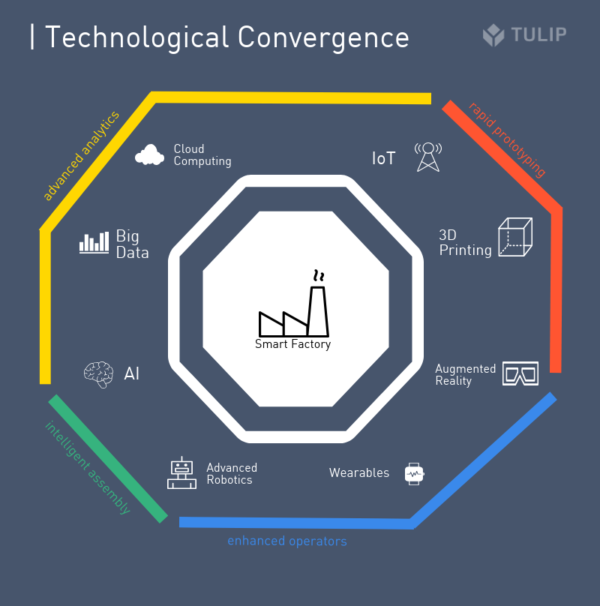

# indus_2022

## Selected Theme

1. ~~Smart Retail -Supermarket~~

2. ~~Smart Disaster Relief – Flood~~

3. **Smart Industrial – Manufacturing**

> 
> **Preliminary Round (19th June 2022)**
>> Teams to submit project proposal by the due date.
>> 
>> 5 teams from each category will be selected to go into semi-finals.
> 
> **Semi Final Round (tentative in October/November 2022)**
>> Each team needs to submit a maximum 10 minute video to present their solutions
>> The judges will assess and select 2 teams from each category (6 teams) to compete in the final round.
> 
> **Final Round (tentative in October/November 2022)**
>> 6 finalist teams to take part in team presentation on a virtual live platform before a panel of judges for question and answer session.

## Proposal

### Title
**Smart Industrial - Manufacturing (more specifically)**

### Executive Summary

> **Please include the brief description of project, literature reviews, objectives, methodology and expected outcomes from the project**

The Smart Factory is a concept for expressing the end goal of digitization in manufacturing.

The way the term is most commonly used, a Smart Factory is a highly digitized shop floor that continuously collects and shares data through connected machines, devices, and production systems. The data can then be used by self-optimizing devices or across the organization to proactively address issues, improve manufacturing processes and respond to new demands.

Various technologies such as AI, Big Data Analytics, Cloud Computing, and Industrial IoT (Internet of Things) have made smart manufacturing practices fully comprehensive.

By connecting the physical and digital world, smart factories can monitor the entire production process, from manufacturing tools and the supply chain to individual operators on the shop floor.

When fully realized, Smart factories use fully integrated, collaborative manufacturing systems to make operations flexible, adaptable, and optimizable.

The manufacturing practice adopted by smart factories – smart manufacturing – is the most optimized application of technologies arising from the fourth industrial revolution known as Industry 4.0.

The smart factory is not about deploying one software across the entire shop floor and seeing immediate improvements in the production process. A combination of various Industry 4.0 technologies contribute to the optimization of smart manufacturing.

Smart factories optimize efficiency and productivity by extending the capabilities of both manufacturing devices and people. By focusing on creating an agile, iterative production process through data collection, smart factories can aid decision-making processes with stronger evidence.

By continuously improving the productivity of manufacturing processes, smart factories can lower costs, reduce downtime and minimize waste. Identifying and reducing misplaced or underused production capacities mean opportunities for growth without investing in additional monetary and/or physical resources.

Advanced robotics are increasingly capbale of complex, highly sensitive assemblies. They generate data on thier production that AI algorithms can analyze. And they are increasingly capbale of work intelligently alongside human operators.

### Detailed Project Proposal

> 1. **Project background including problem statement**

There is no one-size-fits-all strategy for a successful Industry 4.0 transformation. Strategies will vary depending on company size, industry, geography, and competitive forces, among others.

According to a recent WEF report, there are two, complementary routes to scale for companies looking to leverage Industry 4.0 technology to their advantage.

1. Innovate the production system: expand competitive advantage through operational excellence.
2. Innovate the end-to-end value chain: create new businesses by changing the economics of operations.

Along this road there are some common stumbling blocks.

1. Lack of executive vision

The executives who participated in Deloitte’s Digital Transformation survey agreed that a lack of a long-term, detailed executive vision is the greatest barrier in a digital transformation. Devising the right digital strategy requires detailed knowledge of an industry, and the foresight to anticipate which technologies will be most disruptive in a given space. The most successful digital transformations occur when executives set 1, 3, 5, and 10-year goals for their digital transformation.

2. Starting too big

A full digital transformation doesn’t happen overnight. It’s a product of long-term, incremental changes to technological ecosystems. Still, many companies strive for full digitization without filling in the gaps. The best transformations will work from proof-of-concept to proof-of-concept, putting pieces into place as they work toward something larger. They’ll build on early successes, embrace failure, and gradually build a suite of technology solutions that work together.

3. Not connecting the dots

The ideal factory is seamlessly connected. But not all technologies are equally amenable to integration at an early stage. Failing to start with basic infrastructural improvements (wifi, server space, re-skilling, and talent acquisition) can hinder later initiatives. All the data in the world, for example, won’t help without data scientists to make meaning of it.

> 2. **Objective(s) of the Project: This project embarks on the following objectives:**
>> a. **To investigate...**
>> 
> 

> 
>> b. **To assess...**
>>
> 

> 
>> c. **To develop...**
>>
> 

> 
>> d. **To make recommendation based on...**
>>
>
 
> 3. **Methodology**
>> a. **Expected Outcome of the Project**
>> 
> 

> 
>> b. **Intel software used**
>>
> 

## References:
1. [Industry-University Challenge 2022](https://thegreatlab.my/2022indus/)
2. [What Is A Smart Factory? (And What It Means For You)](https://tulip.co/glossary/what-is-a-smart-factory-and-what-it-means-for-you/)
3. [Omni wheel Robot part 1 : prototype](https://www.youtube.com/watch?v=Q4cmc4eKXr0&ab_channel=KrisTemmerman)
4. [Why You Should Use an Omnidirectional Autonomous Mobile Robot (full length)]()
